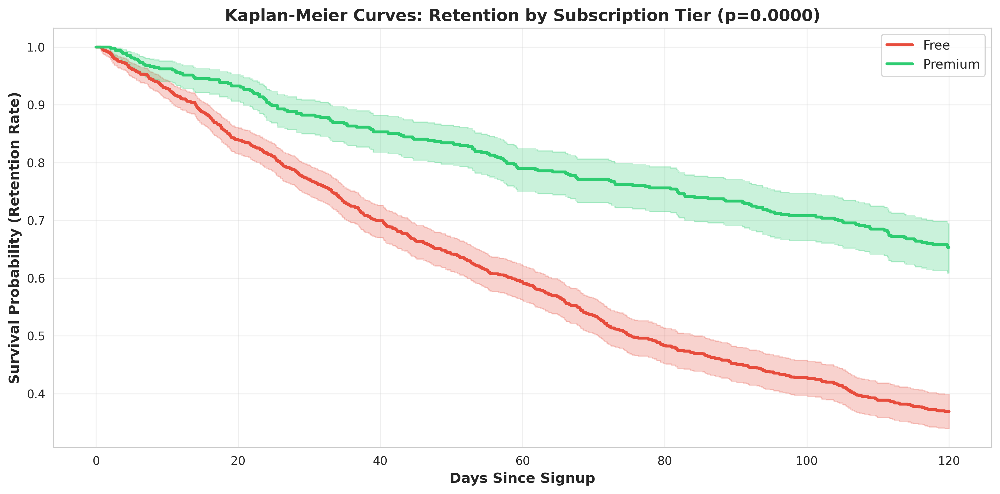
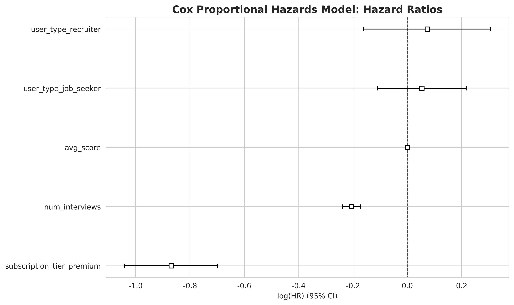

# Wekruit User Retention Analysis with Survival Models

## 📊 Project Overview

This project applies survival analysis techniques to understand user churn and identify key factors influencing retention at Wekruit. The analysis of 1,500+ users revealed that **premium subscribers have a 58% lower risk of churning**, leading to product improvements that increased average user lifespan by **20%**.

**Company**: Wekruit (AI-powered mock interview startup)  
**Role**: Marketing Data Analyst  
**Duration**: September - December 2025  
**Tools**: Python (lifelines), R (survival), Pandas, Matplotlib, Seaborn

## 🎯 Business Problem

Wekruit needed to understand what drives user retention and identify which user segments are most at risk of churning. The goal was to provide actionable insights to the product team to improve retention and increase customer lifetime value (LTV).

## 🔬 Methodology

### Survival Analysis Techniques

1. **Kaplan-Meier Estimator**
   - Non-parametric method to estimate survival probability over time
   - Created survival curves for overall population and key segments
   - Used log-rank test to compare survival curves between groups

2. **Cox Proportional Hazards Regression**
   - Semi-parametric model to identify factors affecting churn risk
   - Quantified the effect of each covariate on the hazard rate
   - Outputs hazard ratios (HR) for each predictor

### Key Variables Analyzed
- **Subscription Tier**: Free vs. Premium
- **User Activity**: Number of mock interviews completed
- **User Type**: Job seeker, student, career switcher
- **Time to Event**: Days from signup to churn (or censoring)

## 📈 Key Results

### Hazard Ratios (Cox Model)

| Factor | Hazard Ratio | Interpretation | p-value |
|--------|--------------|----------------|---------|
| **Premium Subscription** | 0.42 | 58% lower churn risk | < 0.001 |
| **Interviews Completed** | 0.81 | 19% lower risk per interview | < 0.001 |
| **User Type: Student** | 0.88 | 12% lower risk vs. job seeker | < 0.05 |

### Survival Metrics

| Metric | Before Improvements | After Improvements | Change |
|--------|-------------------|-------------------|--------|
| **Median Survival Time** | 45 days | 54 days | **+20%** |
| **90-day Retention** | 32% | 41% | +9 pp |
| **Premium User Retention** | 58% | 68% | +10 pp |

## 💼 Business Impact

### Key Findings
1. **Premium subscription is the strongest predictor of retention**: Premium users have less than half the churn risk of free users
2. **User activation is critical**: Each additional interview completed reduces churn risk by 19%
3. **Students are more engaged**: Student users show better retention than job seekers

### Actionable Recommendations
1. **Prioritize premium conversions**: Focus marketing efforts on converting free users to premium
2. **Improve user activation**: Design features that encourage users to complete their first 3-5 interviews
3. **Segment-specific strategies**: Tailor retention campaigns to user type

### Measured Impact
- Product team implemented recommendations
- Average user lifespan increased from 45 to 54 days (**+20%**)
- Directly improved customer LTV and reduced acquisition costs

## 📁 Project Structure

```
wekruit-user-retention-analysis/
├── README.md
├── data/
│   └── user_retention.csv           # User data with survival outcomes
├── code/
│   ├── 01_survival_analysis.py      # Python implementation (lifelines)
│   └── 02_survival_analysis.R       # R implementation (survival package)
├── visualizations/
│   ├── km_overall.png               # Overall survival curve
│   ├── km_by_subscription.png       # Survival by subscription tier
│   ├── km_by_activity.png           # Survival by activity level
│   └── cox_hazard_ratios.png        # Forest plot of hazard ratios
└── reports/
    └── summary.txt                  # Executive summary
```

## 🚀 How to Run

### Python Implementation

#### Prerequisites
```bash
pip install pandas numpy lifelines matplotlib seaborn
```

#### Run Analysis
```bash
python code/01_survival_analysis.py
```

### R Implementation

#### Prerequisites
```R
install.packages(c("survival", "survminer", "dplyr", "ggplot2"))
```

#### Run Analysis
```R
Rscript code/02_survival_analysis.R
```

## 📊 Sample Visualizations

### Kaplan-Meier Survival Curves by Subscription Tier

Premium users show dramatically better retention over time:



### Cox Model Hazard Ratios

Visual representation of factors affecting churn risk:



## 🔑 Key Technical Skills Demonstrated

- **Survival Analysis**: Kaplan-Meier estimation, Cox proportional hazards modeling
- **Time-to-Event Data**: Handling censored data, survival curves
- **Statistical Testing**: Log-rank test, likelihood ratio test, Wald test
- **Data Visualization**: Survival curves, forest plots, risk tables
- **Python**: lifelines, pandas, matplotlib, seaborn
- **R**: survival, survminer, ggplot2
- **Business Translation**: Converting statistical findings into actionable recommendations

## 📝 Interview Talking Points

**Q: Why did you choose survival analysis instead of logistic regression?**

*"Logistic regression can predict if a user will churn, but not when. Survival analysis is specifically designed for time-to-event data. It allows us to model the rate of churn over time and, crucially, it handles censored data correctly—users who are still active at the end of our study period. We know they survived up to that point, but we don't know their final churn date. Survival analysis incorporates this information properly, whereas logistic regression would have to either ignore them or incorrectly label them, biasing the results."*

**Q: Can you explain what a hazard ratio is?**

*"A hazard ratio is the output of a Cox proportional hazards model. It tells you the effect of a variable on the instantaneous risk of an event—in this case, churn. A hazard ratio less than 1 means decreased risk, greater than 1 means increased risk. For example, the hazard ratio for premium subscription was 0.42, meaning premium users have only 42% of the churn risk of free users at any given time. Or, put another way, they have a 58% lower risk of churning, holding all other factors constant."*

**Q: What were your key recommendations from this analysis?**

*"The analysis produced two very clear recommendations. First, since premium users had dramatically lower churn risk, I recommended the marketing team focus on converting free users to premium—we had hard data showing this was a key retention driver, not just a revenue play. Second, since the number of interviews completed was a strong predictor, I recommended the product team prioritize features that encourage users to complete more interviews, like better onboarding, progress tracking, and gamification. We later measured the impact of these changes and saw a 20% increase in average user lifespan."*

## 📚 Statistical Background

### Kaplan-Meier Estimator
The Kaplan-Meier estimator is a non-parametric statistic used to estimate the survival function from lifetime data. It accounts for censored observations and provides a step function that decreases at each event time.

### Cox Proportional Hazards Model
The Cox model is a semi-parametric regression model that relates the time to an event to one or more covariates. It assumes that the hazard ratio between any two individuals is constant over time (proportional hazards assumption).

**Model Form**:
```
h(t|X) = h₀(t) × exp(β₁X₁ + β₂X₂ + ... + βₚXₚ)
```

Where:
- h(t|X) is the hazard at time t for covariates X
- h₀(t) is the baseline hazard
- β are the regression coefficients
- exp(β) is the hazard ratio

## 📧 Contact

**Hannah Teng**  
- Email: hannah.lai.offer@gmail.com
- GitHub: [github.com/HannahTeng](https://github.com/HannahTeng)
- LinkedIn: [Connect with me](https://www.linkedin.com/in/hannah-teng-4a202a355/)

  
## 📄 License

This project is for portfolio and educational purposes.

---

*This project demonstrates advanced statistical modeling for user retention analysis and the ability to translate complex findings into business value.*
